# Zroshua 💧

**Smart irrigation for Home Assistant** — a native add-on with a full web UI in the sidebar.
Zones on top of your existing `switch`/`valve` entities, watering groups with controlled
concurrency, a conflict-aware scheduler, weather intelligence, rain & soil sensors,
stuck-valve protection, water & energy statistics, a live site map and Telegram notifications.


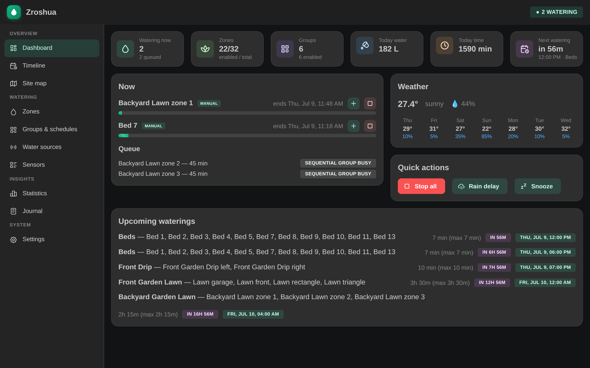

## Why an add-on (not an integration)?

- **Sidebar panel** via ingress — a mobile/tablet-friendly SPA, no custom Lovelace cards, no YAML.
- **Own process** with a Supervisor watchdog: the scheduler runs independently of the HA event
  loop and survives HA restarts (active runs are persisted and resumed).
- **Own database** for run history, skip reasons and consumption statistics.
- Controls any hardware through HA entities: ESPHome, Zigbee, Shelly, anything that is a
  `switch` or `valve`.

## Installation

1. In Home Assistant open **Settings → Add-ons → Add-on Store**.
2. Menu (⋮) → **Repositories** → add:

   ```
   https://github.com/RobinCK/zroshua
   ```

3. Find **Zroshua** in the store and click **Install** (the image is built locally on first
   install — this takes a few minutes).
4. Start the add-on — **Zroshua** appears in the sidebar.

### Add-on options

All irrigation configuration lives in the web UI and applies instantly. The add-on options
hold only system-level settings:

```yaml
log_level: info          # trace | debug | info | warning | error
database:
  driver: sqlite         # sqlite (default) | mariadb | postgres
  # host: core-mariadb   # for external databases
  # port: 3306
  # name: zroshua
  # username: zroshua
  # password: "..."
telegram_bot_token: ""   # optional, from @BotFather
```

- **sqlite** (default): everything lives in `/data`, which is included in Home Assistant
  backups — zero configuration, restore together with the rest of your system.
- **mariadb / postgres**: keep the data in an external database (use host `core-mariadb`
  for the official MariaDB add-on).
- With the **Mosquitto** add-on installed, MQTT credentials are picked up automatically
  from the Supervisor — no configuration needed.

## Tour

### Dashboard

Live overview: what is watering right now (with progress, `+5 min` and stop buttons), the
**queue with the exact reason** each run is waiting (`sequential group busy`, `mutex with
group X`, `flow budget exceeded`…), info tiles (zones, groups, today's water and time),
weather with a 7-day forecast, countdowns to upcoming waterings and quick actions
(stop all / pause all watering for a set number of hours). Tapping a running or queued
zone opens its action sheet (stop, water for a preset, pause).

### Timeline

Each day as a 24-hour strip per group — see exactly when water is busy and when it is free.
Zones are drawn at their planned (unscaled) times — temperature scaling shifts every following
zone of the group, so bars never overlap. Each run then shows its **finish window** as a
translucent tail: medium = may finish earlier (negative scaling), faint = the worst-case
temperature boost. Gaps after the faint tail are guaranteed free time. Runs that violate a
*never-overlap / order* rule are highlighted red with an alert (checked against the worst case).

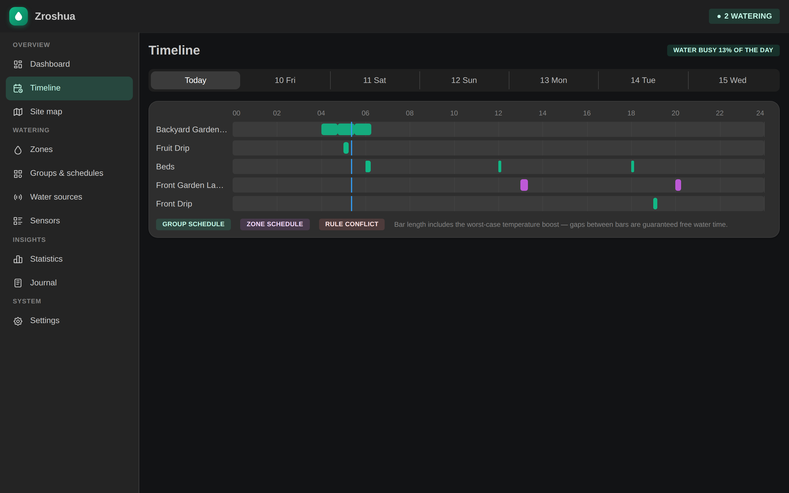

### Groups, schedules and the time-slot picker

A group is an ordered set of zones with schedules and an execution mode: **sequential**
(one zone at a time), **parallel** (all together) or **parallel with a limit**. Add an
inter-zone delay for pressure recovery, a 0–200 % duration multiplier and a priority.

Schedules support a whole-week template or **per-day start times**, several waterings per
day, a seasonal window (`MM-DD`…`MM-DD`), **per-schedule zone durations** (defaults come
from the zone) and **run conditions**.

Start times are picked on a 24-hour occupancy strip: **red bands** are schedules of groups
bound to this one by rules (worst-case length included), gray bands are other schedules,
teal is this run. The picker shows *free until HH:MM* and warns live when the chosen slot
overlaps a rule-bound group; saving with a conflict shows a loud warning.

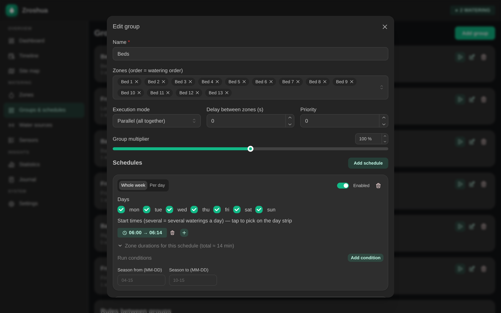
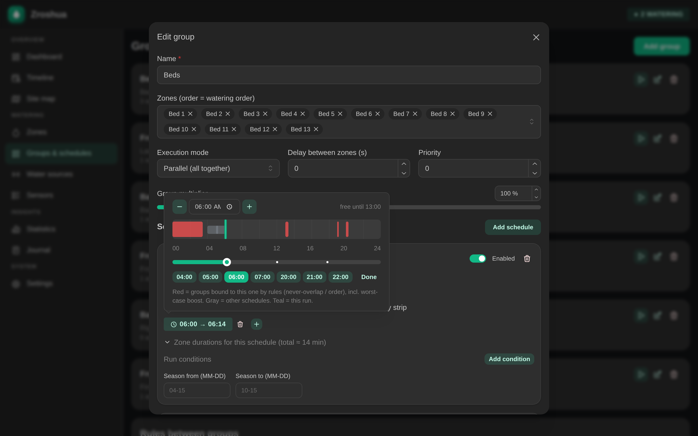

**Rules between groups** encode your hydraulics declaratively:

| Rule | Meaning |
|---|---|
| Never overlap | The groups may never run at the same time. |
| Order (A before B) | B waits until A has finished (e.g. well always before barrel). |
| May run in parallel | Explicitly allowed to overlap (drip lines). |

What happens when a scheduled run still collides at runtime is your choice
(**Settings → conflict policy**): *wait in queue* (default) or *skip the run* for a strict
timetable — always with a journal reason.

### Run conditions

Every schedule (group or zone) can carry criteria checked at start time — all must pass:

- **Forecast max temperature today** ≥ / ≤ X °C (e.g. run the midday cooling cycle only in heat),
- **Forecast rain probability** ≥ / ≤ X %,
- **Any sensor value** at start time (e.g. your outdoor thermometer ≥ 30 °C).

Failures are journaled and notified; **unavailable data never blocks watering** — a dead
sensor won't leave the garden dry.

### Zones

A zone = one irrigation line: one or more HA entities switched together, a default duration
(the preset for manual runs), an optional **flow rate** (exact l/min or a min–max range) used
for statistics and flow budgets, a **max-runtime failsafe**, optional cycle & soak, per-zone
ignore flags (rain sensor / weather) and — when one bed needs more water than
its group — **own schedules** in addition to the group's.

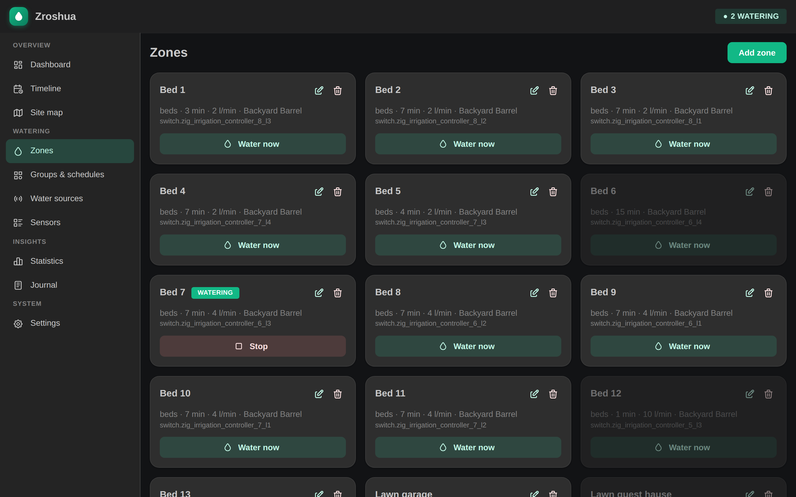

**Manual runs always start**: they ignore the rain sensor, weather and any pause; hydraulic
conflicts produce a warning, not a block. Every manual run is a timer — the zone always
switches off by itself (with the max-runtime failsafe as a second, independent layer).

**Pause** (skip without disabling): every zone and every group has a pause control — pause
its automatic runs for a chosen number of hours (3 / 6 / 12 / 24 / 48) and it resumes by
itself, or resume it manually. There is also a global *Pause all watering* on the dashboard.
A pause only skips **automatic** watering (schedules, soil and weather triggers); manual runs
still work. Use it to skip today's run for one bed or group without turning it off.

### Water sources

Sources make hydraulics first-class: a **max flow budget** (l/min — the scheduler never lets
concurrently running zones exceed it), a **pump entity** kept on while any zone of the source
runs (reference-counted, with start/stop delays), a **dependency** on another source
("blocked while that source runs"), a *water available* sensor, an optional flow sensor with
an idle-flow leak alert, an **energy meter** and a configurable **refill tail** (count pump
energy for N minutes after selected groups finish — e.g. while the barrel refills).

### Sensors

- **Rain** — one or several `binary_sensor`s (leak sensors work great): quorum aggregation
  ("N of M must be wet"), a **dry-out delay** after the last wet signal, skip-at-start and
  stop-during-run behaviour. Zones can ignore the rain sensor individually.
- **Soil moisture** — per zone or group: water for N minutes when moisture drops below a
  threshold, then wait a **cooldown** (soil sensors react slowly); optionally block scheduled
  runs above a wet threshold; stale data is ignored safely. Each trigger can **ignore the rain
  sensor** — soil under a roof or in a greenhouse gets watered even while it rains outside.

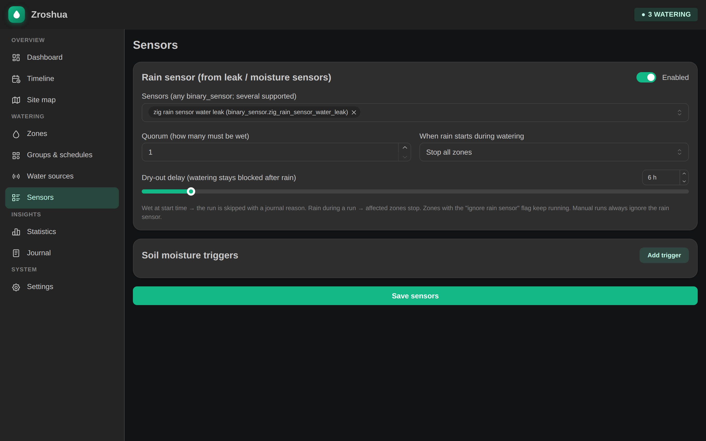

### Site map

Draw your property as an SVG in any editor (Inkscape, Figma, Illustrator) using **any shapes**
— rectangles, paths, polygons, circles — and upload it. Shapes don't need ids; Zroshua adds
them automatically, so a plain Figma export works. In *Assign zones* mode you pick a zone and
tap the shapes that make it up — **a single zone can be several shapes** (a bed drawn as two
rectangles, a lawn split by a path). The map is two-channel: **fill color = watering type**
(sprinkler, drip, beds, lawn, shrubs) so the plan reads like a real garden legend, and **live
state = brightness/animation** — a watering zone brightens and pulses (with its **remaining
minutes** on it), idle is steady, queued shows a moving dashed outline, fault turns red,
disabled fades out. Tapping a zone opens a popup with its status, next run and a water-now
slider. Large plans **zoom and pan** — zoom buttons in the corner and drag to pan on desktop,
**pinch-to-zoom and one-finger drag** on mobile.

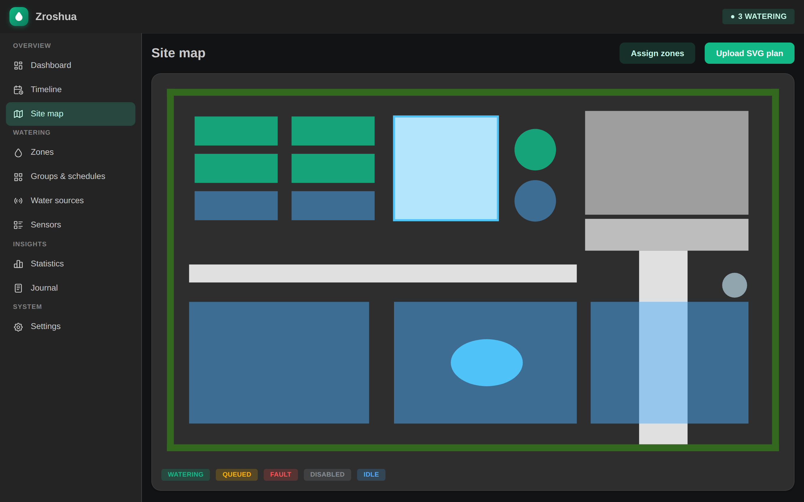

In *Assign zones* mode you pick a zone and paint the shapes that belong to it (green = this
zone, purple = another zone, gray = free):

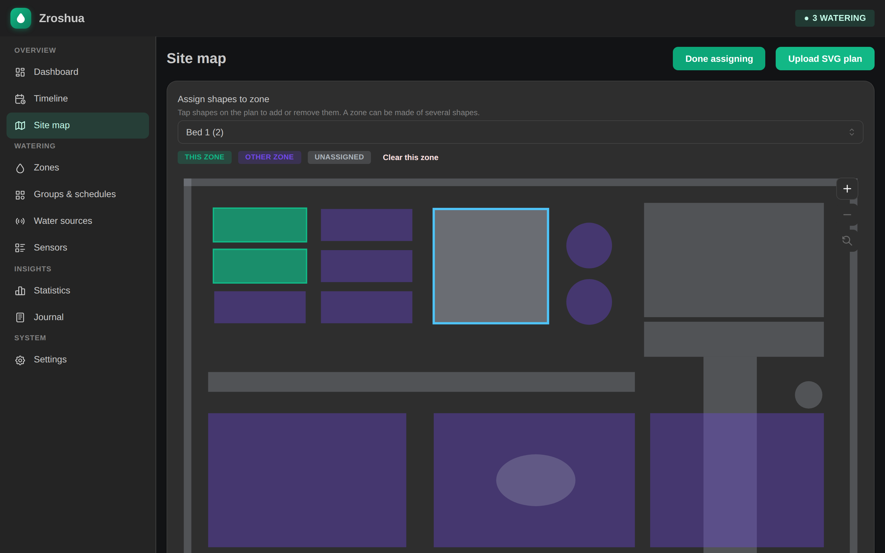

### Statistics

Calculated liters per run (flow rate × actual duration; ranges give min–max estimates),
minutes and **pump energy measured only while watering** (kWh counters and W power sensors
both work) plus the refill-tail category. Set a tariff and currency to see costs. Daily
charts and CSV export.

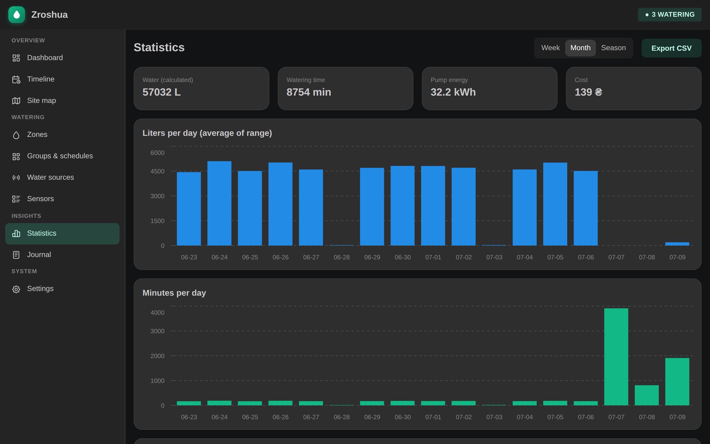

### Journal

Every decision is explainable: run started/finished (duration), **every skip with its
reason** (rain sensor wet, forecast, condition failed, below-minimum rollover, conflict
policy…), temperature adjustments, faults, reconciliations.

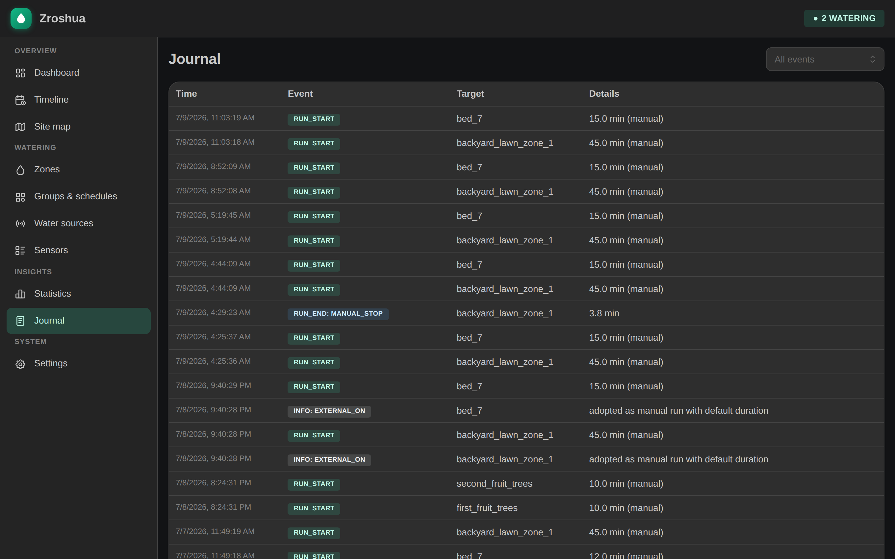

### Settings

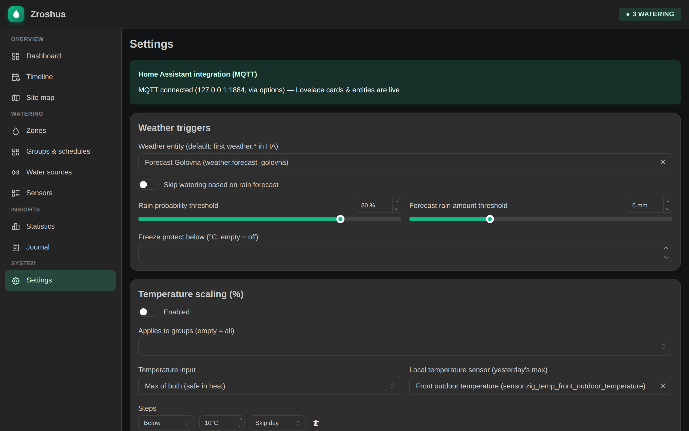

- **Weather triggers**: skip the day when rain probability ≥ X % *and* forecast amount ≥ Y mm;
  freeze protect below a threshold. Location and forecast come from your HA weather entity.
- **Temperature scaling** in percent steps (e.g. below 20 °C → skip; below 25 °C → −10 %;
  above 30 °C → +20 %), driven by the forecast max, **yesterday's max from your own sensor**,
  or a combination. Planning always reserves the worst-case boost, so boosted runs can never
  break group rules.
- **Conflict policy**: wait in queue vs. skip (strict timetable).
- **Pre-start availability check**: if a zone's entity or its source pump is `unavailable`
  within a configurable window (default 30 min) before a scheduled start, you get a fault
  notification naming the exact entity.
- **Notifications**: Telegram (several chat IDs) and/or any HA `notify.*` service, each with
  its own event filter — started, finished (duration + time to next run), skipped (with
  reason), stopped by rain, faults, system.
- **External switch policy**: a zone turned on outside Zroshua is either adopted as a manual
  run (auto-off) or switched back off.
- **Backup**: export/import the whole configuration as JSON.

### Mobile

The UI is mobile-first — this is how the dashboard looks in the HA companion app:

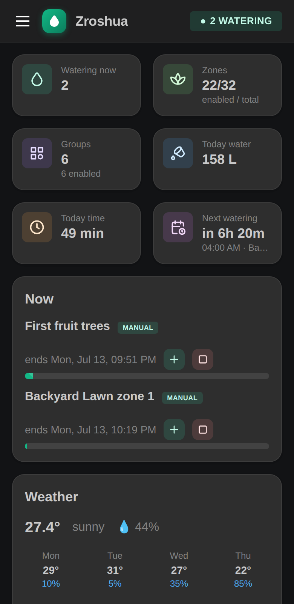

## Reliability guarantees

- **Check-back on every switch**: a zone that fails to turn on is skipped (the rest of the
  plan continues); a zone that fails to turn **off** triggers escalation — source pump
  shutdown, repeated retries, critical notification.
- Independent **max-runtime failsafe** per zone.
- **Restart-safe**: active runs are persisted and resumed; on startup any zone found "on"
  without a matching run is reconciled off.
- Optional **idle-flow leak detection** per source (water flowing while nothing runs).

## Lovelace cards

For controlling irrigation straight from a Home Assistant dashboard — without opening the
add-on — Zroshua ships a custom Lovelace card with five views. When the Mosquitto add-on is
present the card works with **zero setup**: the add-on copies `zroshua-card.js` into
`/config/www` and registers it as a dashboard resource automatically (on YAML-mode
dashboards, add the resource `/local/zroshua-card.js` as a *module* manually).

Add a card to any view:

```yaml
type: custom:zroshua-card
view: dashboard   # dashboard | groups | zones | upcoming | timeline
title: Irrigation # optional
```

| View | What it shows |
|---|---|
| `dashboard` | Tiles (watering now / queued / water today / next), live runs with progress + stop, the queue with reasons, tap a run/queued zone for its action sheet, and stop-all / pause-all buttons. |
| `groups` | Modern tiles per group: execution mode, "N watering · M queued" while running, countdown to the next start and a full-width **Run / Stop group** button. |
| `zones` | Zones grouped into sections by watering group with **filter chips** (All / Active / Idle / Off); tapping a zone opens an action sheet with duration presets and Stop — built for dozens of zones. |
| `upcoming` | The next scheduled runs with countdowns. |
| `timeline` | Today's 24-hour occupancy strip per group (conflicts in red). |

The card reads a single `sensor.zroshua_state` entity (published over MQTT) and sends actions
back through the `mqtt.publish` service — so it stays live and needs no per-entity wiring.

> **Requires MQTT.** The cards and the native entities below need a broker. Install the
> **Mosquitto broker** add-on and the **MQTT** integration — credentials are then picked up
> automatically. For an external broker, set `mqtt.host` (and port/username/password) in the
> add-on options. The add-on's **Settings** page shows a live MQTT status banner; if it says
> *MQTT off*, the card will display "Waiting for sensor.zroshua_state".

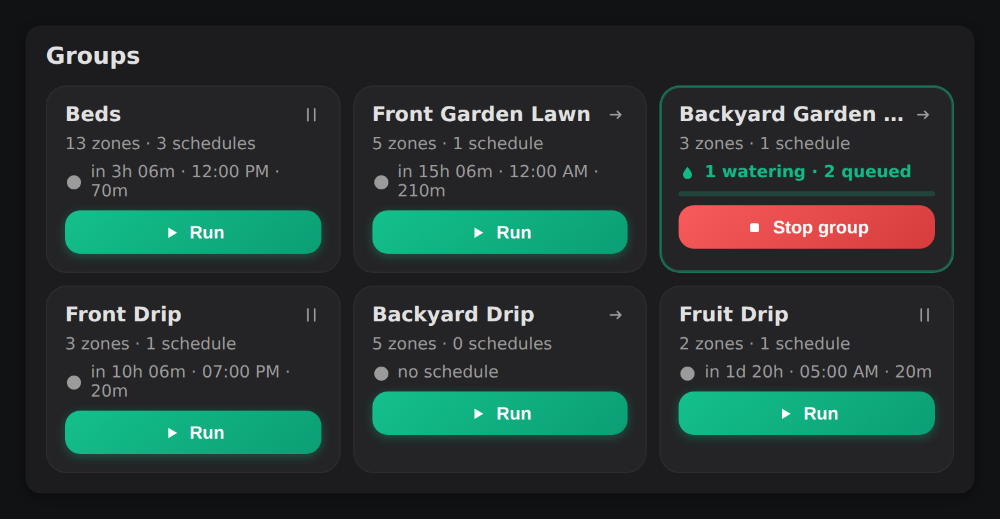

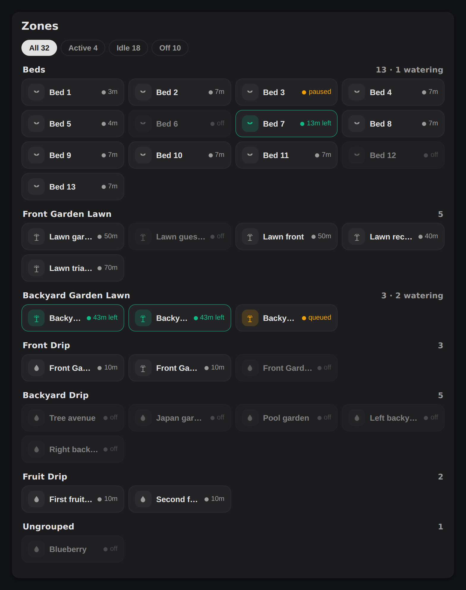

| `dashboard` | `upcoming` |
|---|---|
| 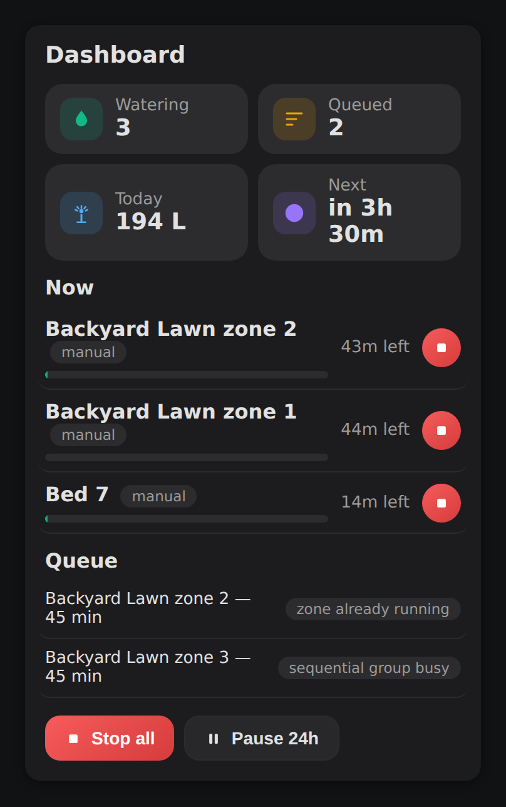 | 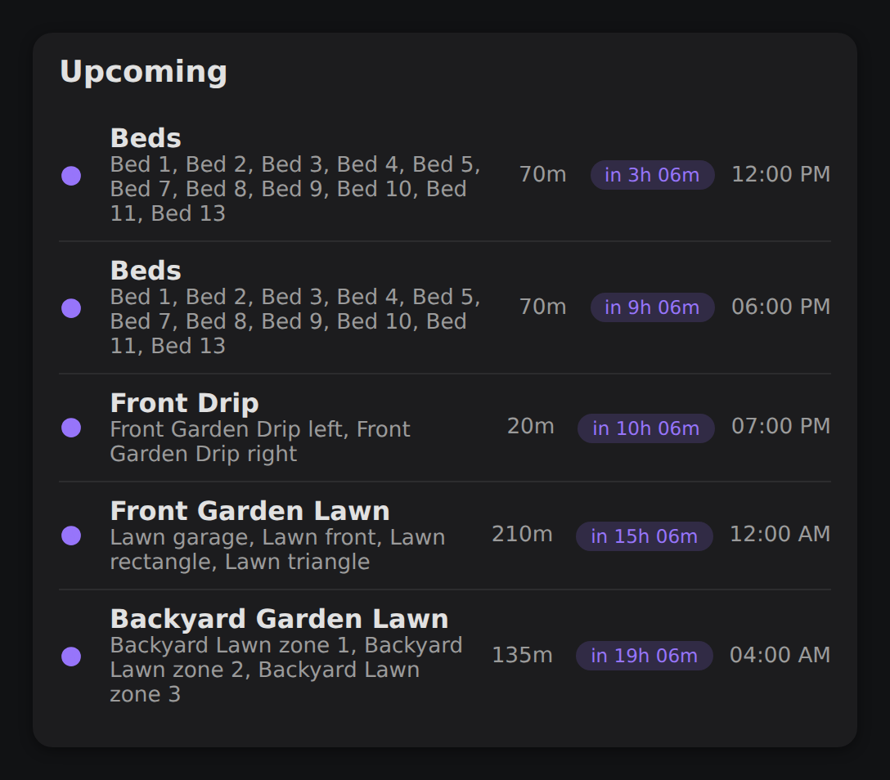 |

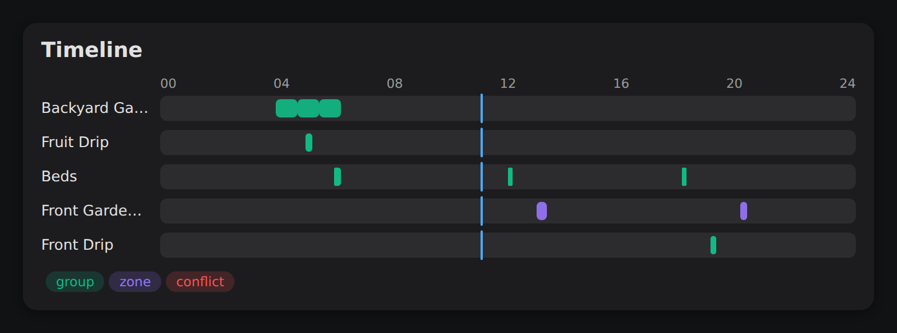

Group tiles have a **pause** control (and the zone action sheet a Pause / Resume button) so
you can skip a group or a single zone for a few hours without disabling it. Tapping a zone
opens a floating action sheet over the list — no scrolling even with dozens of zones:

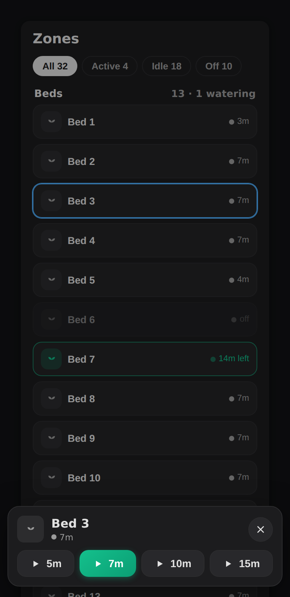

## Native HA entities (MQTT discovery)

With the Mosquitto add-on installed, Zroshua automatically publishes a "Zroshua" device:
per-zone watering switches (turn on = manual run with auto-off), next-watering timestamp
sensors, a watering-active binary sensor, daily water/energy sensors **plus a daily water
sensor per water source** (well vs. barrel) and a pause-all switch. The consumption sensors
carry `device_class`/`state_class`, so Home Assistant records long-term statistics — the
built-in *statistics-graph* card charts liters per hour / day / week out of the box, and
the sensors fit the Energy dashboard. Availability uses a Last-Will message, so a dead
add-on shows *unavailable* instead of stale states.

## Documentation

- [Add-on documentation](zroshua/DOCS.md) — the detailed feature guide (also shown in the
  add-on's Documentation tab).

## Development

```bash
# backend (NestJS + TypeORM)
cd zroshua/backend && npm install && npm run build && node dist/main.js
# frontend (React + Vite + Mantine) — dev server proxies /api to :8099
cd zroshua/frontend && npm install && npm run dev
```

Roadmap: ET/bucket-based suggested durations, volume-based watering, Telegram inline
actions, uk localization.

## License

MIT
